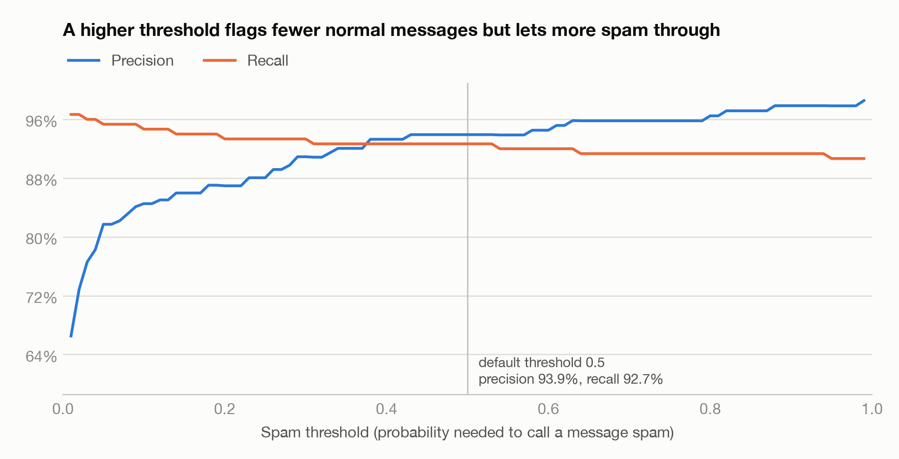
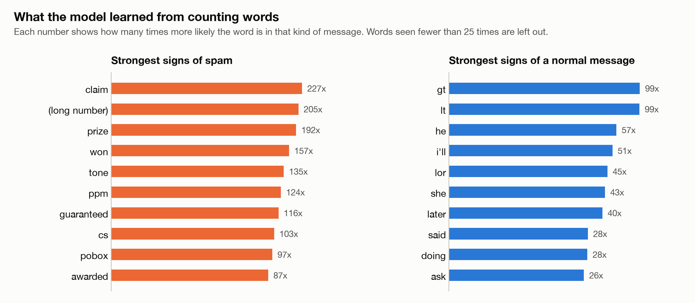

# Spam Detector From Scratch

A spam message classifier where the learning algorithm is written in plain Python. No machine learning library does the work: the Naive Bayes model, the tokenizer and the evaluation metrics are all implemented here and checked against scikit-learn.

| | |
|---|---|
| **Accuracy on unseen messages** | 98.21% (1,096 of 1,116) |
| **Spam caught (recall)** | 92.67% |
| **Flagged messages that really were spam (precision)** | 93.92% |
| **Agreement with scikit-learn** | 1,116 of 1,116 predictions, probabilities within 1.4e-14 |
| **Core dependencies** | None. The model uses only the Python standard library |

## What it does

Type a text message and the app tells you whether it is spam, how confident it is, and why. Every word in the message is shaded by how strongly it pushed the decision towards spam or towards a normal message, so the prediction is never a black box.

A slider lets you move the spam threshold and watch precision and recall change on 1,116 test messages.

## Results

The model is trained on 4,458 messages and tested on 1,116 messages it has never seen.

| Model | Accuracy | Precision | Recall | F1 |
|---|---|---|---|---|
| Always answer "not spam" (baseline) | 86.56% | 0.00% | 0.00% | 0.00% |
| **Naive Bayes, this project** | **98.21%** | **93.92%** | **92.67%** | **93.29%** |
| scikit-learn `MultinomialNB` | 98.21% | 93.92% | 92.67% | 93.29% |

The baseline row is the reason accuracy alone is not enough. About 87% of the messages are normal, so a model that never flags anything scores 86.56% while catching no spam at all. Precision and recall show what accuracy hides.

What the model did with the 1,116 test messages:

| | Predicted spam | Predicted not spam |
|---|---|---|
| **Actually spam** (150) | 139 caught | 11 missed |
| **Actually normal** (966) | 9 wrongly flagged | 957 let through |

### Checked against scikit-learn

The same training data and the same tokenizer are given to scikit-learn's `MultinomialNB`. The two models give the same answer on every test message, and the largest difference between their probabilities is 1.4e-14, which is floating-point rounding. This comparison runs as part of `python -m spamdetector.evaluate` and as an automated test.

### The precision and recall trade-off

A message is called spam when its spam probability reaches the threshold. A higher threshold makes the model more cautious: fewer normal messages are flagged by mistake, but more spam gets through. Which side matters more depends on the use. For a text inbox, losing a real message is usually worse than seeing one spam.

### What the model learned

Nobody told the model which words matter. These rankings come only from counting words in labelled messages.

## How it works

1. **Tokenize.** Each message is lowercased and split into words. Links, currency symbols and numbers are replaced by placeholders such as `<url>` and `<longnum>`, because the presence of a phone number is a useful clue while its exact digits are not.
2. **Count.** Training counts how often every word appears in spam and in normal messages.
3. **Score.** For a new message, each class gets a score:

   ~~~
   score(class) = log P(class) + sum of log P(word | class) for every word in the message

   P(word | class) = (times the word appears in the class + 1) / (total words in the class + vocabulary size)
   ~~~

4. **Decide.** The two scores are turned into a spam probability and compared with the threshold.
5. **Explain.** For each word, `log P(word | spam) - log P(word | normal)` says which way it pushed and how hard. Together with the starting odds, these values add up exactly to the final decision, which is what the app displays.

### Design decisions

| Decision | Reason |
|---|---|
| Add logarithms instead of multiplying probabilities | Multiplying hundreds of small numbers rounds to zero on a computer |
| Add 1 to every count (Laplace smoothing) | A word never seen in spam would otherwise have probability zero and overrule every other word |
| Skip words not seen in training | They carry no evidence either way, and this matches scikit-learn's behaviour |
| Keep the spam ratio equal in the train and test sets | Only 13% of messages are spam, so a random split could leave the test set unrepresentative |
| Fix the random seed | Anyone who runs the code gets exactly the numbers in this README |

## Limitations

- **The data is old and narrow.** The messages are English SMS, mostly from the UK and Singapore, collected before 2012. Modern scams, other languages and other platforms will look different.
- **Word order is ignored.** "Free tonight? Call me" and "Call now, free prize" share words that mean different things. Naive Bayes sees only the words.
- **The probabilities are overconfident.** The model treats words as independent, which they are not, so it often reports 99.9% when the honest figure is lower. The ranking of messages is more trustworthy than the exact percentage.
- **One train and test split.** The results come from a single fixed split, not cross-validation, so they would move slightly with a different split.

## Run it yourself

Requires Python 3.10 or newer. Developed and tested on Python 3.12.

~~~bash
git clone https://github.com/abhipsa1808-afk/spam-detector-from-scratch.git
cd spam-detector-from-scratch
python3 -m venv .venv
source .venv/bin/activate
pip install -r requirements-dev.txt
~~~

| Command | What it does |
|---|---|
| `streamlit run streamlit_app.py` | Opens the demo in your browser |
| `python -m spamdetector.evaluate` | Trains the model and prints the comparison table above |
| `python -m spamdetector.plots` | Redraws the two charts |
| `pytest` | Runs the 25 tests |

## Project structure

~~~
spamdetector/
  tokenizer.py     Turns a message into word tokens
  model.py         Naive Bayes: fit, predict, predict_proba, explain
  metrics.py       Accuracy, precision, recall and F1
  data.py          Loads the dataset and makes the train and test split
  evaluate.py      Comparison with the baseline and scikit-learn
  plots.py         Draws the charts in this README
streamlit_app.py   The web demo
tests/             25 tests
data/              The SMS Spam Collection dataset
~~~

## Tests

The 25 tests run on every push through GitHub Actions. They include a prediction checked against a calculation done by hand, a check that the explanation values add up to the prediction, a comparison with scikit-learn, and tests that load the web app and confirm its verdicts.

## Dataset

[SMS Spam Collection](https://archive.ics.uci.edu/dataset/228/sms+spam+collection) by Tiago Almeida and José María Gómez Hidalgo, from the UCI Machine Learning Repository, licensed under CC BY 4.0. It contains 5,574 messages, of which 747 are spam.

## Author

**Abhipsa Rout**, BTech Computer Science student at Manipal University. GitHub: [@abhipsa1808-afk](https://github.com/abhipsa1808-afk)

The code is released under the [MIT License](LICENSE).
